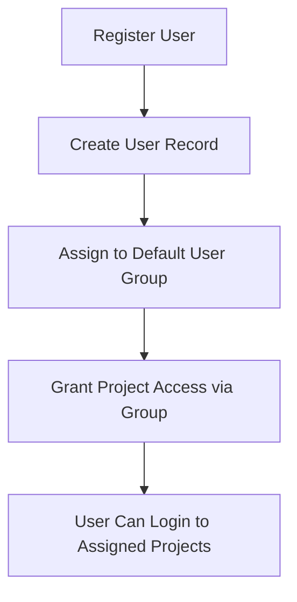
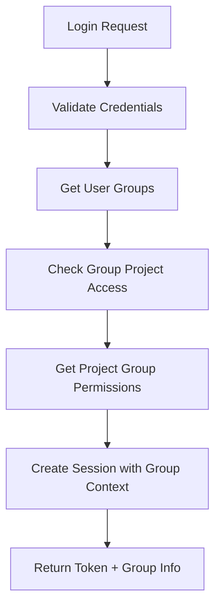
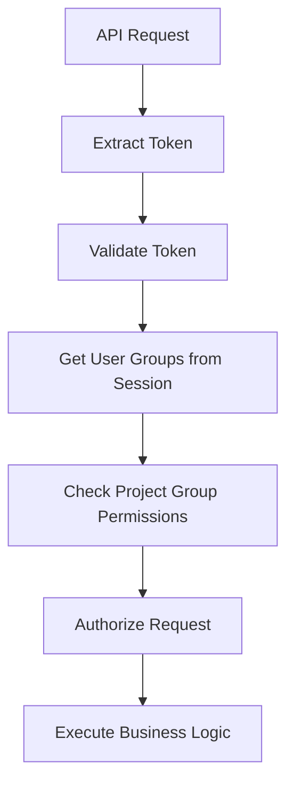

# Authentication API

Complete authentication endpoint documentation for the **3-Tier User Type Multi-Project Authentication** system.

## 🔐 Overview

### Authentication Methods

All authenticated endpoints support **two authentication methods**:

**1. Bearer Token (Header):**
```
Authorization: Bearer YOUR_SESSION_TOKEN
```

**2. HTTP-Only Cookie (Automatic):**
- Cookie name: `session_token`
- Set automatically on login/register
- Preferred for web applications
- More secure (httponly, secure, samesite flags)

> **Note:** The API automatically sets a secure HTTP-only cookie on successful login/register. Web applications can rely on this cookie for automatic authentication without managing tokens manually.

### Response Format

All responses follow a standardized format:

**Success Response:**
```json
{
  "success": true,
  "message": "Operation description",
  "...": "Endpoint-specific data"
}
```

**Error Response:**
```json
{
  "success": false,
  "error": {
    "code": "ERROR_CODE",
    "category": "error_category",
    "message": "Human-readable error message",
    "details": {
      "additional": "context information"
    }
  }
}
```

### Error Code Categories

| Category | Codes | Description |
|----------|-------|-------------|
| **Authentication** | AUTH_1xxx | Login, session, and credential errors |
| **Authorization** | AUTHZ_2xxx | Permission and access control errors |
| **Validation** | VAL_3xxx | Input validation and format errors |
| **Not Found** | NF_4xxx | Resource not found errors |
| **Conflict** | CONF_5xxx | Duplicate resources and conflicts |
| **Database** | DB_6xxx | Database operation errors |
| **Internal** | INT_7xxx | Internal server errors |

**Note:** UUID values in error messages are automatically masked for security (e.g., `[proj]...[c789]`).

## 🏗️ 3-Tier User Type System

The authentication system supports three distinct user types:

1. **ROOT USERS**: Super administrators with unrestricted global access
2. **ADMIN USERS**: Project-specific administrators limited to their assigned project  
3. **CONSUMER USERS**: End users with RBAC-based permissions through groups

## 🎯 Core Authentication Flow

```
1. Login → Get session token with user type & group context
2. Use token → Access resources based on user type privileges
3. Switch projects → Get new token for different project (if allowed by user type)
4. Logout → Invalidate session
```

---

## 🚨 Common Error Codes

The following error codes are used across authentication endpoints:

### Authentication Errors (AUTH_1xxx)

| Code | Status | Description |
|------|--------|-------------|
| **AUTH_1001** | 401 | Invalid credentials (username or password) |
| **AUTH_1002** | 401 | Session expired or invalid |
| **AUTH_1003** | 401 | Session invalid (malformed) |
| **AUTH_1004** | 401 | Token invalid or malformed |
| **AUTH_1005** | 401 | Account inactive or disabled |

### Authorization Errors (AUTHZ_2xxx)

| Code | Status | Description |
|------|--------|-------------|
| **AUTHZ_2001** | 403 | Access denied - general |
| **AUTHZ_2002** | 403 | Insufficient permissions for operation |
| **AUTHZ_2003** | 403 | Project access denied |
| **AUTHZ_2004** | 403 | Group access denied |

### Validation Errors (VAL_3xxx)

| Code | Status | Description |
|------|--------|-------------|
| **VAL_3001** | 400 | Invalid input data |
| **VAL_3002** | 400 | Missing required field(s) |
| **VAL_3003** | 400 | Invalid format |
| **VAL_3004** | 400 | Invalid UUID format |

### Not Found Errors (NF_4xxx)

| Code | Status | Description |
|------|--------|-------------|
| **NF_4001** | 404 | User not found |
| **NF_4002** | 404 | Project not found |
| **NF_4003** | 404 | User group not found |

### Conflict Errors (CONF_5xxx)

| Code | Status | Description |
|------|--------|-------------|
| **CONF_5001** | 409 | Username already exists |
| **CONF_5002** | 409 | Email already exists |
| **CONF_5003** | 409 | Resource already exists |

### Internal Errors (INT_7xxx)

| Code | Status | Description |
|------|--------|-------------|
| **INT_7001** | 500 | Internal server error |
| **INT_7002** | 500 | Configuration error |

---

## 📡 Authentication Endpoints

### POST `/auth/login`

Authenticate user and login to a specific project or automatically select project context.

**How it works:**
- **Root users**: Get global session with no project binding, can access all projects
- **With project_hash**: Login to the specified project (if user has access)
- **Without project_hash**: Admin/Consumer users are automatically placed in first accessible project
- All users receive a list of accessible projects for project switching

**Request Body** (form-data):
- `username` (required): User's username or email
- `password` (required): User's password
- `project_hash` (optional): Specific project hash to login to

**Example Request - Login to Specific Project:**
```bash
curl -X POST "http://localhost:8000/auth/login" \
  -H "Content-Type: application/x-www-form-urlencoded" \
  -d "username=john_doe&password=SecurePass123&project_hash=proj_xyz789abc"
```

**Example Request - Auto-select Project:**
```bash
curl -X POST "http://localhost:8000/auth/login" \
  -H "Content-Type: application/x-www-form-urlencoded" \
  -d "username=john_doe&password=SecurePass123"
```

**Success Response (200) - Root User:**
```json
{
  "success": true,
  "message": "Root user login successful - global access granted",
  "session_token": "eyJhbGciOiJIUzI1NiIsInR5cCI6IkpXVCJ9...",
  "user": {
    "user_hash": "root_a1b2c3d4e5f6",
    "username": "root_admin",
    "email": "root@example.com",
    "user_type": "root"
  },
  "project": null,
  "accessible_projects": [
    {
      "project_hash": "proj_xyz789abc",
      "project_name": "Main Project",
      "project_description": "Primary application project"
    },
    {
      "project_hash": "proj_def456ghi",
      "project_name": "Analytics Dashboard",
      "project_description": "Analytics and reporting system"
    }
  ]
}
```

**Success Response (200) - Admin/Consumer User:**
```json
{
  "success": true,
  "message": "Login successful",
  "session_token": "eyJhbGciOiJIUzI1NiIsInR5cCI6IkpXVCJ9...",
  "user": {
    "user_hash": "user_f6e5d4c3b2a1",
    "username": "john_doe",
    "email": "john@example.com",
    "user_type": "consumer"
  },
  "project": {
    "project_hash": "proj_xyz789abc",
    "project_name": "Main Project",
    "project_description": "Primary application project"
  },
  "accessible_projects": [
    {
      "project_hash": "proj_xyz789abc",
      "project_name": "Main Project",
      "project_description": "Primary application project"
    },
    {
      "project_hash": "proj_abc123def",
      "project_name": "Mobile App",
      "project_description": "Mobile application backend"
    }
  ]
}
```

**Error Responses:**

**401 - Invalid Credentials:**
```json
{
  "success": false,
  "error": {
    "code": "AUTH_1001",
    "category": "authentication",
    "message": "Invalid username or password",
    "details": {
      "username": "john_doe"
    }
  }
}
```

**403 - No Project Access:**
```json
{
  "success": false,
  "error": {
    "code": "AUTHZ_2001",
    "category": "authorization",
    "message": "User has no access to any project",
    "details": {
      "username": "john_doe"
    }
  }
}
```

**403 - Project Access Denied:**
```json
{
  "success": false,
  "error": {
    "code": "AUTHZ_2003",
    "category": "authorization",
    "message": "Access denied to project [proj]...[c789]. User has access to 3 project(s)",
    "details": {
      "requested_project": "[proj]...[c789]",
      "accessible_projects_count": 3
    }
  }
}
```

**404 - Project Not Found:**
```json
{
  "success": false,
  "error": {
    "code": "NF_4002",
    "category": "not_found",
    "message": "Project not found: [proj]...[c789]"
  }
}
```

**400 - Missing Parameters:**
```json
{
  "success": false,
  "error": {
    "code": "VAL_3002",
    "category": "validation",
    "message": "Username and password are required",
    "details": {
      "missing_fields": ["username", "password"]
    }
  }
}
```

---

### POST `/auth/register`

Register a new user and assign them to a user group with automatic project access.

**Request Body** (form-data):
- `username` (required): Desired username (minimum 3 characters)
- `password` (required): User's password (minimum 8 characters recommended)
- `email` (optional): User's email address
- `user_group_hash` (required): User group hash to assign the new user to

**Example Request:**
```bash
curl -X POST "http://localhost:8000/auth/register" \
  -H "Content-Type: application/x-www-form-urlencoded" \
  -d "username=john_doe&password=SecurePass123&email=john@example.com&user_group_hash=group_abc123def"
```

**Success Response (200):**
```json
{
  "success": true,
  "message": "User registered successfully",
  "user": {
    "user_hash": "user_new9876543",
    "username": "john_doe",
    "email": "john@example.com",
    "user_type": "consumer"
  },
  "project": {
    "project_hash": "proj_xyz789abc",
    "project_name": "Main Project"
  }
}
```

> **Note:** While the register endpoint sets a secure HTTP-only cookie with the session token, the `session_token` field is not returned in the JSON response body. Web applications should rely on the cookie for subsequent authenticated requests. If you need the token value, use the `/auth/login` endpoint instead.

**Error Responses:**

**409 - Username Already Exists:**
```json
{
  "success": false,
  "error": {
    "code": "CONF_5001",
    "category": "conflict",
    "message": "Username already exists",
    "details": {
      "username": "john_doe"
    }
  }
}
```

**409 - Email Already Exists:**
```json
{
  "success": false,
  "error": {
    "code": "CONF_5002",
    "category": "conflict",
    "message": "Email already exists",
    "details": {
      "email": "john@example.com"
    }
  }
}
```

**404 - Invalid Group:**
```json
{
  "success": false,
  "error": {
    "code": "NF_4003",
    "category": "not_found",
    "message": "User group not found"
  }
}
```

**400 - Missing Required Fields:**
```json
{
  "success": false,
  "error": {
    "code": "VAL_3002",
    "category": "validation",
    "message": "Required fields are missing",
    "details": {
      "missing_fields": ["username", "password", "user_group_hash"]
    }
  }
}
```

---

### GET `/auth/validate`

Validate session token and return user information with group context.

**Authentication:** Required

**Example Request:**
```bash
curl -X GET "http://localhost:8000/auth/validate" \
  -H "Authorization: Bearer YOUR_SESSION_TOKEN"
```

**Response (200) - Consumer User:**
```json
{
  "success": true,
  "valid": true,
  "user": {
    "user_hash": "user_f6e5d4c3b2a1",
    "username": "john_doe",
    "user_type": "consumer"
  },
  "project": {
    "project_hash": "proj_xyz789abc",
    "project_name": "Main Project",
    "project_description": "Primary application project"
  },
  "session": {
    "created_at": null,
    "is_global_session": false
  }
}
```

**Error Responses:**

**401 - Invalid or Expired Session:**
```json
{
  "success": false,
  "error": {
    "code": "AUTH_1002",
    "category": "authentication",
    "message": "Invalid or expired session",
    "details": {
      "hint": "Please log in again"
    }
  }
}
```

**Response (200) - Root User (Global Session):**
```json
{
  "success": true,
  "valid": true,
  "user": {
    "user_hash": "root_a1b2c3d4e5f6",
    "username": "root_admin",
    "user_type": "root"
  },
  "project": {
    "project_hash": "",
    "project_name": "Global Root Access",
    "project_description": "Unrestricted global access for root user"
  },
  "session": {
    "created_at": null,
    "is_global_session": true
  }
}
```

---

### POST `/auth/logout`

Logout user and invalidate session. Clears session cookie and removes session from Redis.

**Authentication:** Required

**Example Request:**
```bash
curl -X POST "http://localhost:8000/auth/logout" \
  -H "Authorization: Bearer YOUR_SESSION_TOKEN"
```

**Success Response (200):**
```json
{
  "success": true,
  "message": "Logged out successfully"
}
```

**Error Responses:**

**401 - Invalid Session:**
```json
{
  "success": false,
  "error": {
    "code": "AUTH_1002",
    "category": "authentication",
    "message": "Invalid or expired session"
  }
}
```

**Note:** After logout, the session token becomes invalid and cannot be used for subsequent requests.

---

### POST `/auth/switch-project`

Switch to a different project that the user's group has access to. Creates a new session token with updated project context.

**Authentication:** Required

**Request Body** (form-data):
- `project_hash` (required): Hash of the project to switch to

**Example Request:**
```bash
curl -X POST "http://localhost:8000/auth/switch-project" \
  -H "Authorization: Bearer YOUR_SESSION_TOKEN" \
  -H "Content-Type: application/x-www-form-urlencoded" \
  -d "project_hash=proj_def456ghi"
```

**Success Response (200):**
```json
{
  "success": true,
  "message": "Successfully switched to project: Analytics Dashboard",
  "session_token": "eyJhbGciOiJIUzI1NiIsInR5cCI6IkpXVCJ9.NEW_TOKEN...",
  "project": {
    "project_hash": "proj_def456ghi",
    "project_name": "Analytics Dashboard",
    "project_description": "Analytics and reporting system"
  },
  "user_groups": []
}
```

**Error Responses:**

**401 - Invalid Session:**
```json
{
  "success": false,
  "error": {
    "code": "AUTH_1003",
    "category": "authentication",
    "message": "Invalid session"
  }
}
```

**404 - Project Not Found:**
```json
{
  "success": false,
  "error": {
    "code": "NF_4002",
    "category": "not_found",
    "message": "Project not found: [proj]...[c789]"
  }
}
```

**404 - User Not Found:**
```json
{
  "success": false,
  "error": {
    "code": "NF_4001",
    "category": "not_found",
    "message": "User not found"
  }
}
```

**403 - Access Denied:**
```json
{
  "success": false,
  "error": {
    "code": "AUTHZ_2003",
    "category": "authorization",
    "message": "Access denied to requested project",
    "details": {
      "project_hash": "[proj]...[c789]"
    }
  }
}
```

---

### POST `/auth/check-availability`

Check if username or email is available globally before registration.

**Request Body** (form-data):
- `username` (optional): Username to check
- `email` (optional): Email to check

**Note:** At least one parameter (username or email) must be provided.

**Example Request:**
```bash
curl -X POST "http://localhost:8000/auth/check-availability" \
  -H "Content-Type: application/x-www-form-urlencoded" \
  -d "username=new_user&email=new@example.com"
```

**Success Response (200):**
```json
{
  "success": true,
  "username_available": true,
  "email_available": false
}
```

**Example - Username Only:**
```bash
curl -X POST "http://localhost:8000/auth/check-availability" \
  -H "Content-Type: application/x-www-form-urlencoded" \
  -d "username=john_doe"
```

**Response:**
```json
{
  "success": true,
  "username_available": false,
  "email_available": null
}
```

**Error Responses:**

**400 - Missing Parameters:**
```json
{
  "success": false,
  "error": {
    "code": "VAL_3001",
    "category": "validation",
    "message": "Username or email required"
  }
}
```

**500 - Internal Error:**
```json
{
  "success": false,
  "error": {
    "code": "INT_7001",
    "category": "internal",
    "message": "Availability check error"
  }
}
```

---

## 🔧 Authentication Middleware

### POST `/auth/refresh`

Refresh JWT token and extend session while maintaining the same session context.

**Authentication:** Required

**Example Request:**
```bash
curl -X POST "http://localhost:8000/auth/refresh" \
  -H "Authorization: Bearer YOUR_SESSION_TOKEN"
```

**Success Response (200):**
```json
{
  "success": true,
  "message": "Token refreshed successfully",
  "session_token": "eyJhbGciOiJIUzI1NiIsInR5cCI6IkpXVCJ9.REFRESHED_TOKEN...",
  "user": {
    "user_hash": "user_f6e5d4c3b2a1",
    "username": "john_doe",
    "email": "john@example.com",
    "user_type": "consumer"
  },
  "project": {
    "project_hash": "proj_xyz789abc",
    "project_name": "Main Project",
    "project_description": "Primary application project"
  },
  "accessible_projects": []
}
```

**Error Responses:**

**401 - Invalid or Expired Session:**
```json
{
  "success": false,
  "error": {
    "code": "AUTH_1002",
    "category": "authentication",
    "message": "Invalid or expired session"
  }
}
```

**404 - User Not Found:**
```json
{
  "success": false,
  "error": {
    "code": "NF_4001",
    "category": "not_found",
    "message": "User not found"
  }
}
```

**404 - Project Not Found:**
```json
{
  "success": false,
  "error": {
    "code": "NF_4002",
    "category": "not_found",
    "message": "Project not found"
  }
}
```

**Use Cases:**
- Extend session before it expires
- Update session after user profile changes
- Maintain authentication for long-running applications

---

### HEAD `/access`

> **Note:** This endpoint is defined in `/routes/Access.py`, not in the auth module, but is documented here for reference as it's commonly used for authentication validation.

Validate session token and check permissions (middleware endpoint). Returns user hash in response header.

**Authentication:** Required

**Example Request:**
```bash
curl -X HEAD "http://localhost:8000/access" \
  -H "Authorization: Bearer YOUR_SESSION_TOKEN" \
  -I
```

**Response:**
- **204**: Token is valid
  - **Header**: `X_user_HASH: user_f6e5d4c3b2a1`
- **401**: Token is invalid or expired
- **403**: Token valid but insufficient permissions

**Example Success Response:**
```
HTTP/1.1 204 No Content
X_user_HASH: user_f6e5d4c3b2a1
Content-Length: 0
```

---

## 🏗️ Group-Based Authentication Flow

### 1. User Registration & Group Assignment



### 2. Login Process with Groups



### 3. Request Authorization



---

## 🔐 Security Features

### Session Security
- **3-day default expiration** (72 hours = 259,200 seconds)
- **Automatic cleanup of expired sessions** via Redis TTL
- **Group context included in sessions**
- **Redis-based session storage** for performance and scalability
- **HTTP-only cookies** set automatically on login/register
- **Cookie settings:**
  - `httponly=True` - Prevents JavaScript access
  - `secure=True` - HTTPS only
  - `samesite="strict"` - CSRF protection
  - `max_age=259200` - 72 hours

**Session Storage Format:**
Each session is stored in Redis as `session:{token}` containing:
```json
{
  "session_id": 123456789,
  "user_id": "internal_id",
  "user_hash": "user_abc123",
  "user_type": "consumer",
  "project_id": "internal_id",
  "project_hash": "proj_xyz789",
  "project_name": "Project Name"
}
```

### Group-Based Security
- **Users only see projects their groups access**
- **Permissions determined by project groups**
- **Cross-project switching through user groups**
- **Complete audit trail of group assignments**
- **Automatic group resolution** on authentication

### Token Security
- **JWT-style session tokens** with embedded context
- **Cryptographic signing** prevents tampering
- **Session ID included** for server-side validation
- **Group information embedded** in token payload
- **Automatic refresh on project switch**
- **Old tokens invalidated** on refresh/logout
- **UUID masking** in error messages for security

---

## 🧪 Testing Authentication

### Complete Login Flow Test

```bash
#!/bin/bash

# Step 1: Get list of available projects (if you have admin access)
echo "1. Getting available projects..."
PROJECTS=$(curl -s -X GET "http://localhost:8000/projects" \
  -H "Authorization: Bearer ADMIN_TOKEN")
echo "Available projects: $PROJECTS"

# Step 2: Login to specific project
echo -e "\n2. Testing login to specific project..."
LOGIN_RESPONSE=$(curl -s -X POST "http://localhost:8000/auth/login" \
  -H "Content-Type: application/x-www-form-urlencoded" \
  -d "username=john_doe&password=SecurePass123&project_hash=proj_xyz789abc")

echo "Login Response: $LOGIN_RESPONSE"

# Extract token and project info
TOKEN=$(echo $LOGIN_RESPONSE | jq -r '.session_token')
PROJECT_NAME=$(echo $LOGIN_RESPONSE | jq -r '.project.project_name')
echo "Logged into project: $PROJECT_NAME"

# Step 3: Validate session
echo -e "\n3. Testing token validation..."
VALIDATE_RESPONSE=$(curl -s -X GET "http://localhost:8000/auth/validate" \
  -H "Authorization: Bearer $TOKEN")
echo "Session validation: $VALIDATE_RESPONSE"

# Step 4: Switch to another project
echo -e "\n4. Testing project switch..."
SWITCH_RESPONSE=$(curl -s -X POST "http://localhost:8000/auth/switch-project" \
  -H "Authorization: Bearer $TOKEN" \
  -H "Content-Type: application/x-www-form-urlencoded" \
  -d "project_hash=proj_abc123def")
echo "Project switch response: $SWITCH_RESPONSE"

# Update token after switch
NEW_TOKEN=$(echo $SWITCH_RESPONSE | jq -r '.session_token')

# Step 5: Logout
echo -e "\n5. Testing logout..."
curl -X POST "http://localhost:8000/auth/logout" \
  -H "Authorization: Bearer $NEW_TOKEN"
```

### Basic Authentication Test (Auto-select Project)

```bash
#!/bin/bash

# Test authentication flow with auto project selection
echo "1. Testing registration..."
curl -X POST "http://localhost:8000/auth/register" \
  -H "Content-Type: application/x-www-form-urlencoded" \
  -d "username=testuser&password=testpass&email=test@example.com&user_group_hash=group_abc123"

echo -e "\n2. Testing login (auto-select project)..."
LOGIN_RESPONSE=$(curl -s -X POST "http://localhost:8000/auth/login" \
  -H "Content-Type: application/x-www-form-urlencoded" \
  -d "username=testuser&password=testpass")

echo "Login Response: $LOGIN_RESPONSE"

# Extract token
TOKEN=$(echo $LOGIN_RESPONSE | jq -r '.session_token')

echo -e "\n3. Testing token validation..."
curl -X GET "http://localhost:8000/auth/validate" \
  -H "Authorization: Bearer $TOKEN"

echo -e "\n4. Testing logout..."
curl -X POST "http://localhost:8000/auth/logout" \
  -H "Authorization: Bearer $TOKEN"
```

### Group-Based Access Test

```bash
#!/bin/bash

# Test group-based access
echo "1. Login as admin..."
ADMIN_RESPONSE=$(curl -s -X POST "http://localhost:8000/auth/login" \
  -H "Content-Type: application/x-www-form-urlencoded" \
  -d "username=admin&password=admin123&project_hash=YOUR_PROJECT_HASH")

ADMIN_TOKEN=$(echo $ADMIN_RESPONSE | jq -r '.session_token')

echo "2. Test access to admin endpoints..."
curl -X GET "http://localhost:8000/admin/user-groups" \
  -H "Authorization: Bearer $ADMIN_TOKEN"

echo "3. Login as regular user..."
USER_RESPONSE=$(curl -s -X POST "http://localhost:8000/auth/login" \
  -H "Content-Type: application/x-www-form-urlencoded" \
  -d "username=regularuser&password=userpass&project_hash=YOUR_PROJECT_HASH")

USER_TOKEN=$(echo $USER_RESPONSE | jq -r '.session_token')

echo "4. Test limited access..."
curl -X GET "http://localhost:8000/users/profile" \
  -H "Authorization: Bearer $USER_TOKEN"
```

---

## 📝 Implementation Notes

### Key Differences from Standard REST APIs

1. **Dual Authentication Support**
   - All authenticated endpoints accept both Bearer tokens and HTTP-only cookies
   - Cookies are set automatically on login/register
   - Web applications can omit Authorization headers if cookies are enabled

2. **Error Response Format**
   - Uses structured error responses with `success: false` and nested `error` object
   - Includes error codes for programmatic handling
   - UUIDs are automatically masked in error messages (e.g., `[proj]...[c789]`)

3. **Session Management**
   - Sessions stored in Redis with 72-hour TTL
   - Session includes user context, project context, and group information
   - JWT tokens contain session_id for server-side validation
   - Logout invalidates both token and cookie

4. **Project Context**
   - Root users have global access (no project context required)
   - Admin/Consumer users must have project context in their session
   - Auto-selection of first accessible project if none specified
   - Project switching creates new token and invalidates old one

5. **Group-Based Access**
   - User access to projects is determined by user group membership
   - Permissions within projects are determined by project group assignments
   - Login returns list of all accessible projects for UI convenience

### Security Considerations

1. **Token Handling**
   - Never log or expose full tokens in error messages
   - Tokens should be treated as sensitive credentials
   - Implement token rotation via `/auth/refresh` for long-running sessions

2. **Cookie Security**
   - Cookies require HTTPS in production (`secure=True`)
   - JavaScript cannot access tokens (`httponly=True`)
   - CSRF protection via `samesite="strict"`

3. **UUID Masking**
   - All UUIDs in error responses are masked for security
   - Only first 4 and last 4 characters shown
   - Example: `proj_123e4567-e89b-12d3-a456-426614174000` → `proj-[123e]...[4000]`

4. **Session Expiration**
   - Default 72-hour expiration
   - No automatic token refresh (client must call `/auth/refresh`)
   - Expired sessions return AUTH_1002 error code

### Best Practices for Client Implementation

1. **Web Applications**
   - Rely on HTTP-only cookies for authentication
   - No need to manage tokens manually
   - Handle 401 errors by redirecting to login

2. **Mobile/Desktop Applications**
   - Use Bearer token authentication
   - Store tokens securely (encrypted storage)
   - Implement automatic token refresh before expiration
   - Handle 401 errors by prompting for re-authentication

3. **Error Handling**
   - Check `success` field in all responses
   - Use `error.code` for programmatic error handling
   - Display `error.message` to users (already sanitized)
   - Log `error.details` for debugging (does not contain sensitive data)

4. **Project Switching**
   - Store list of accessible projects from login response
   - Allow users to switch projects via UI
   - Update stored token after successful switch
   - Handle ACCESS_DENIED errors gracefully

---

**Next:** Learn about [User Type Management API](user-type-management.md) or explore [Admin API](admin.md) for group management. 