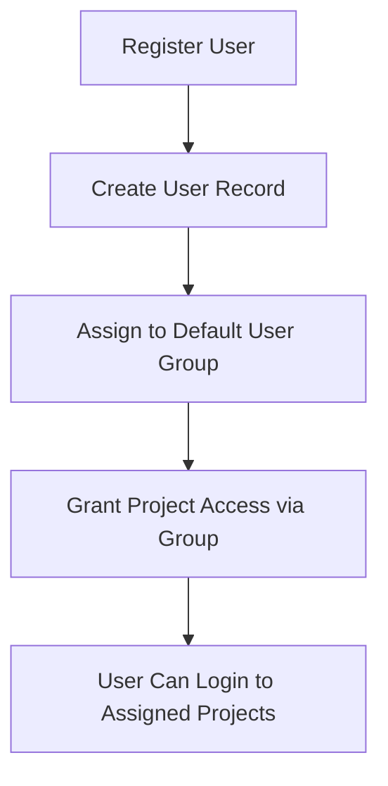
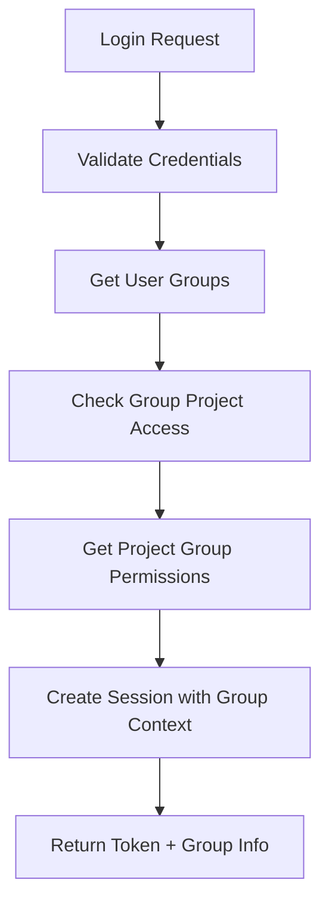
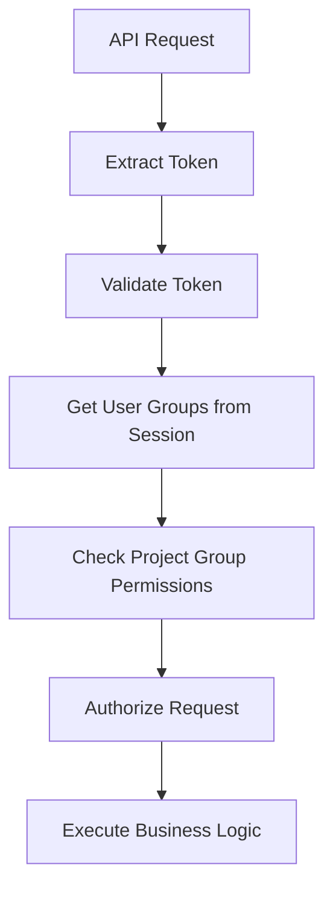

# Authentication API

Complete authentication endpoint documentation for the **3-Tier User Type Multi-Project Authentication** system.

## 🔐 Overview

All authenticated endpoints require a session token in the Authorization header:

```
Authorization: Bearer YOUR_SESSION_TOKEN
```

## 🏗️ 3-Tier User Type System

The authentication system supports three distinct user types:

1. **ROOT USERS**: Super administrators with unrestricted global access
2. **ADMIN USERS**: Project-specific administrators limited to their assigned project  
3. **CONSUMER USERS**: End users with RBAC-based permissions through groups

## 🎯 Core Authentication Flow

```
1. Login → Get session token with user type & group context
2. Use token → Access resources based on user type privileges
3. Switch projects → Get new token for different project (if allowed by user type)
4. Logout → Invalidate session
```

---

## 📡 Authentication Endpoints

### POST `/auth/login`

Authenticate user and login to a specific project or automatically select project context.

**How it works:**
- **Root users**: Get global session with no project binding, can access all projects
- **With project_hash**: Login to the specified project (if user has access)
- **Without project_hash**: Admin/Consumer users are automatically placed in first accessible project
- All users receive a list of accessible projects for project switching

**Request Body** (form-data):
- `username` (required): User's username or email
- `password` (required): User's password
- `project_hash` (optional): Specific project hash to login to

**Example Request - Login to Specific Project:**
```bash
curl -X POST "http://localhost:8000/auth/login" \
  -H "Content-Type: application/x-www-form-urlencoded" \
  -d "username=john_doe&password=SecurePass123&project_hash=proj_xyz789abc"
```

**Example Request - Auto-select Project:**
```bash
curl -X POST "http://localhost:8000/auth/login" \
  -H "Content-Type: application/x-www-form-urlencoded" \
  -d "username=john_doe&password=SecurePass123"
```

**Success Response (200) - Root User:**
```json
{
  "success": true,
  "message": "Root user login successful - global access granted",
  "session_token": "eyJhbGciOiJIUzI1NiIsInR5cCI6IkpXVCJ9...",
  "user": {
    "user_hash": "root_a1b2c3d4e5f6",
    "username": "root_admin",
    "email": "root@example.com",
    "user_type": "root"
  },
  "project": null,
  "accessible_projects": [
    {
      "project_hash": "proj_xyz789abc",
      "project_name": "Main Project",
      "project_description": "Primary application project"
    },
    {
      "project_hash": "proj_def456ghi",
      "project_name": "Analytics Dashboard",
      "project_description": "Analytics and reporting system"
    }
  ]
}
```

**Success Response (200) - Admin/Consumer User:**
```json
{
  "success": true,
  "message": "Login successful",
  "session_token": "eyJhbGciOiJIUzI1NiIsInR5cCI6IkpXVCJ9...",
  "user": {
    "user_hash": "user_f6e5d4c3b2a1",
    "username": "john_doe",
    "email": "john@example.com",
    "user_type": "consumer"
  },
  "project": {
    "project_hash": "proj_xyz789abc",
    "project_name": "Main Project",
    "project_description": "Primary application project"
  },
  "accessible_projects": [
    {
      "project_hash": "proj_xyz789abc",
      "project_name": "Main Project",
      "project_description": "Primary application project"
    },
    {
      "project_hash": "proj_abc123def",
      "project_name": "Mobile App",
      "project_description": "Mobile application backend"
    }
  ]
}
```

**Error Responses:**

**401 - Invalid Credentials:**
```json
{
  "detail": "Invalid credentials"
}
```

**403 - No Project Access:**
```json
{
  "detail": "User has no access to any project"
}
```

**403 - Unauthorized Project Access:**
```json
{
  "detail": "Access denied to project. User has access to 3 project(s)."
}
```

**404 - Project Not Found:**
```json
{
  "detail": "Specified project not found"
}
```

**400 - Missing Parameters:**
```json
{
  "detail": "Username and password are required"
}
```

---

### POST `/auth/register`

Register a new user and assign them to a user group with automatic project access.

**Request Body** (form-data):
- `username` (required): Desired username (minimum 3 characters)
- `password` (required): User's password (minimum 8 characters recommended)
- `email` (optional): User's email address
- `user_group_hash` (required): User group hash to assign the new user to

**Example Request:**
```bash
curl -X POST "http://localhost:8000/auth/register" \
  -H "Content-Type: application/x-www-form-urlencoded" \
  -d "username=john_doe&password=SecurePass123&email=john@example.com&user_group_hash=group_abc123def"
```

**Success Response (200):**
```json
{
  "success": true,
  "message": "User registered successfully",
  "user": {
    "user_hash": "user_new9876543",
    "username": "john_doe",
    "email": "john@example.com",
    "user_type": "consumer"
  },
  "project": {
    "project_hash": "proj_xyz789abc",
    "project_name": "Main Project"
  }
}
```

**Error Responses:**

**409 - Username Already Exists:**
```json
{
  "detail": "Username already exists"
}
```

**409 - Email Already Exists:**
```json
{
  "detail": "Email already exists"
}
```

**400 - Invalid Group:**
```json
{
  "detail": "User group not found"
}
```

---

### GET `/auth/validate`

Validate session token and return user information with group context.

**Authentication:** Required

**Example Request:**
```bash
curl -X GET "http://localhost:8000/auth/validate" \
  -H "Authorization: Bearer YOUR_SESSION_TOKEN"
```

**Response (200) - Consumer User:**
```json
{
  "success": true,
  "valid": true,
  "user": {
    "user_hash": "user_f6e5d4c3b2a1",
    "username": "john_doe",
    "user_type": "consumer"
  },
  "project": {
    "project_hash": "proj_xyz789abc",
    "project_name": "Main Project",
    "project_description": "Primary application project"
  },
  "session": {
    "created_at": null,
    "is_global_session": false
  }
}
```

**Response (200) - Root User (Global Session):**
```json
{
  "success": true,
  "valid": true,
  "user": {
    "user_hash": "root_a1b2c3d4e5f6",
    "username": "root_admin",
    "user_type": "root"
  },
  "project": {
    "project_hash": "",
    "project_name": "Global Root Access",
    "project_description": "Unrestricted global access for root user"
  },
  "session": {
    "created_at": null,
    "is_global_session": true
  }
}
```

---

### POST `/auth/logout`

Logout user and invalidate session. Clears session cookie and removes session from Redis.

**Authentication:** Required

**Example Request:**
```bash
curl -X POST "http://localhost:8000/auth/logout" \
  -H "Authorization: Bearer YOUR_SESSION_TOKEN"
```

**Success Response (200):**
```json
{
  "success": true,
  "message": "Logged out successfully"
}
```

**Note:** After logout, the session token becomes invalid and cannot be used for subsequent requests.

---

### POST `/auth/switch-project`

Switch to a different project that the user's group has access to. Creates a new session token with updated project context.

**Authentication:** Required

**Request Body** (form-data):
- `project_hash` (required): Hash of the project to switch to

**Example Request:**
```bash
curl -X POST "http://localhost:8000/auth/switch-project" \
  -H "Authorization: Bearer YOUR_SESSION_TOKEN" \
  -H "Content-Type: application/x-www-form-urlencoded" \
  -d "project_hash=proj_def456ghi"
```

**Success Response (200):**
```json
{
  "success": true,
  "message": "Successfully switched to project: Analytics Dashboard",
  "session_token": "eyJhbGciOiJIUzI1NiIsInR5cCI6IkpXVCJ9.NEW_TOKEN...",
  "project": {
    "project_hash": "proj_def456ghi",
    "project_name": "Analytics Dashboard",
    "project_description": "Analytics and reporting system"
  },
  "user_groups": []
}
```

**Error Responses:**

**404 - Project Not Found:**
```json
{
  "detail": "Project not found"
}
```

**403 - Access Denied:**
```json
{
  "detail": "Access denied to requested project"
}
```

---

### POST `/auth/check-availability`

Check if username or email is available globally before registration.

**Request Body** (form-data):
- `username` (optional): Username to check
- `email` (optional): Email to check

**Note:** At least one parameter (username or email) must be provided.

**Example Request:**
```bash
curl -X POST "http://localhost:8000/auth/check-availability" \
  -H "Content-Type: application/x-www-form-urlencoded" \
  -d "username=new_user&email=new@example.com"
```

**Success Response (200):**
```json
{
  "success": true,
  "username_available": true,
  "email_available": false
}
```

**Example - Username Only:**
```bash
curl -X POST "http://localhost:8000/auth/check-availability" \
  -H "Content-Type: application/x-www-form-urlencoded" \
  -d "username=john_doe"
```

**Response:**
```json
{
  "success": true,
  "username_available": false,
  "email_available": null
}
```

**Error Response (400):**
```json
{
  "detail": "Username or email required"
}
```

---

## 🔧 Authentication Middleware

### POST `/auth/refresh`

Refresh JWT token and extend session while maintaining the same session context.

**Authentication:** Required

**Example Request:**
```bash
curl -X POST "http://localhost:8000/auth/refresh" \
  -H "Authorization: Bearer YOUR_SESSION_TOKEN"
```

**Success Response (200):**
```json
{
  "success": true,
  "message": "Token refreshed successfully",
  "session_token": "eyJhbGciOiJIUzI1NiIsInR5cCI6IkpXVCJ9.REFRESHED_TOKEN...",
  "user": {
    "user_hash": "user_f6e5d4c3b2a1",
    "username": "john_doe",
    "email": "john@example.com",
    "user_type": "consumer"
  },
  "project": {
    "project_hash": "proj_xyz789abc",
    "project_name": "Main Project",
    "project_description": "Primary application project"
  },
  "accessible_projects": []
}
```

**Use Cases:**
- Extend session before it expires
- Update session after user profile changes
- Maintain authentication for long-running applications

---

### HEAD `/access`

Validate session token and check permissions (middleware endpoint). Returns user hash in response header.

**Authentication:** Required

**Example Request:**
```bash
curl -X HEAD "http://localhost:8000/access" \
  -H "Authorization: Bearer YOUR_SESSION_TOKEN" \
  -I
```

**Response:**
- **204**: Token is valid
  - **Header**: `X_user_HASH: user_f6e5d4c3b2a1`
- **401**: Token is invalid or expired
- **403**: Token valid but insufficient permissions

**Example Success Response:**
```
HTTP/1.1 204 No Content
X_user_HASH: user_f6e5d4c3b2a1
Content-Length: 0
```

---

## 🏗️ Group-Based Authentication Flow

### 1. User Registration & Group Assignment



### 2. Login Process with Groups



### 3. Request Authorization



---

## 🔐 Security Features

### Session Security
- **3-day default expiration**
- **Automatic cleanup of expired sessions**
- **Group context included in sessions**
- **Redis-based session storage for performance**

### Group-Based Security
- **Users only see projects their groups access**
- **Permissions determined by project groups**
- **Cross-project switching through user groups**
- **Complete audit trail of group assignments**

### Token Security
- **JWT-style session tokens**
- **Cryptographic signing**
- **Group information embedded**
- **Automatic refresh on project switch**

---

## 🧪 Testing Authentication

### Complete Login Flow Test

```bash
#!/bin/bash

# Step 1: Get list of available projects (if you have admin access)
echo "1. Getting available projects..."
PROJECTS=$(curl -s -X GET "http://localhost:8000/projects" \
  -H "Authorization: Bearer ADMIN_TOKEN")
echo "Available projects: $PROJECTS"

# Step 2: Login to specific project
echo -e "\n2. Testing login to specific project..."
LOGIN_RESPONSE=$(curl -s -X POST "http://localhost:8000/auth/login" \
  -H "Content-Type: application/x-www-form-urlencoded" \
  -d "username=john_doe&password=SecurePass123&project_hash=proj_xyz789abc")

echo "Login Response: $LOGIN_RESPONSE"

# Extract token and project info
TOKEN=$(echo $LOGIN_RESPONSE | jq -r '.session_token')
PROJECT_NAME=$(echo $LOGIN_RESPONSE | jq -r '.project.project_name')
echo "Logged into project: $PROJECT_NAME"

# Step 3: Validate session
echo -e "\n3. Testing token validation..."
VALIDATE_RESPONSE=$(curl -s -X GET "http://localhost:8000/auth/validate" \
  -H "Authorization: Bearer $TOKEN")
echo "Session validation: $VALIDATE_RESPONSE"

# Step 4: Switch to another project
echo -e "\n4. Testing project switch..."
SWITCH_RESPONSE=$(curl -s -X POST "http://localhost:8000/auth/switch-project" \
  -H "Authorization: Bearer $TOKEN" \
  -H "Content-Type: application/x-www-form-urlencoded" \
  -d "project_hash=proj_abc123def")
echo "Project switch response: $SWITCH_RESPONSE"

# Update token after switch
NEW_TOKEN=$(echo $SWITCH_RESPONSE | jq -r '.session_token')

# Step 5: Logout
echo -e "\n5. Testing logout..."
curl -X POST "http://localhost:8000/auth/logout" \
  -H "Authorization: Bearer $NEW_TOKEN"
```

### Basic Authentication Test (Auto-select Project)

```bash
#!/bin/bash

# Test authentication flow with auto project selection
echo "1. Testing registration..."
curl -X POST "http://localhost:8000/auth/register" \
  -H "Content-Type: application/x-www-form-urlencoded" \
  -d "username=testuser&password=testpass&email=test@example.com&user_group_hash=group_abc123"

echo -e "\n2. Testing login (auto-select project)..."
LOGIN_RESPONSE=$(curl -s -X POST "http://localhost:8000/auth/login" \
  -H "Content-Type: application/x-www-form-urlencoded" \
  -d "username=testuser&password=testpass")

echo "Login Response: $LOGIN_RESPONSE"

# Extract token
TOKEN=$(echo $LOGIN_RESPONSE | jq -r '.session_token')

echo -e "\n3. Testing token validation..."
curl -X GET "http://localhost:8000/auth/validate" \
  -H "Authorization: Bearer $TOKEN"

echo -e "\n4. Testing logout..."
curl -X POST "http://localhost:8000/auth/logout" \
  -H "Authorization: Bearer $TOKEN"
```

### Group-Based Access Test

```bash
#!/bin/bash

# Test group-based access
echo "1. Login as admin..."
ADMIN_RESPONSE=$(curl -s -X POST "http://localhost:8000/auth/login" \
  -H "Content-Type: application/x-www-form-urlencoded" \
  -d "username=admin&password=admin123&project_hash=YOUR_PROJECT_HASH")

ADMIN_TOKEN=$(echo $ADMIN_RESPONSE | jq -r '.session_token')

echo "2. Test access to admin endpoints..."
curl -X GET "http://localhost:8000/admin/user-groups" \
  -H "Authorization: Bearer $ADMIN_TOKEN"

echo "3. Login as regular user..."
USER_RESPONSE=$(curl -s -X POST "http://localhost:8000/auth/login" \
  -H "Content-Type: application/x-www-form-urlencoded" \
  -d "username=regularuser&password=userpass&project_hash=YOUR_PROJECT_HASH")

USER_TOKEN=$(echo $USER_RESPONSE | jq -r '.session_token')

echo "4. Test limited access..."
curl -X GET "http://localhost:8000/users/profile" \
  -H "Authorization: Bearer $USER_TOKEN"
```

---

**Next:** Learn about [User Type Management API](user-type-management.md) or explore [Admin API](admin.md) for group management. 